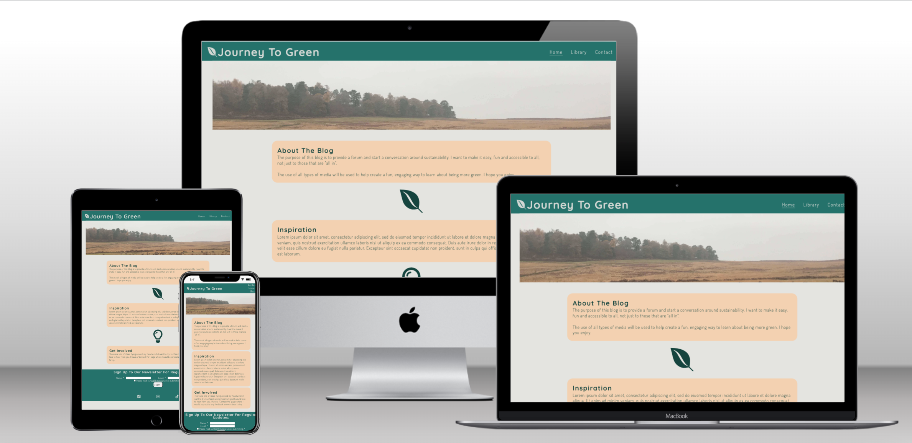

# A Journey to Green

The purpose of the website is to provide the user a means to read and understand methods of how to become more green, environmental and sustainable. This is done through a series of informational blog posts.

## 1. Design and Development

For the design of this website, the 5 pillars of User Experience Design (UXD) were used to cover the strategy, scope, structure, skeleton and surface to make sure the design is intuitive, simple and enjoyable.

### 1.1 Strategy

The target user audience is for any adult / teenager that wants to read blog posts on how to be more green and environmental, however a wider scope could be considered.

Interviews and workshops with users and stakeholders were conducted to understand their requirements and perspectives for the quiz.

Research was conducted on similar websites to understand how they work; the presentation of the blog posts, from a format and an information architecture point of view; and most importantly how the user would feel moving through the website. 

### 1.2 Scope

From the research and interviews conducted with the target audience and stakeholders, user stories were created to determine the flow of the app. The focus was put on the following user stories:

The user stories were prioritised and it was concluded that stories 1, 2, 4 and 6 were taken forward into the scope and stories 3 and 5 were added as additional features to deploy in a future release. User story 1 was adapted and made simpler with functionality to just view a series of blog posts, search, filter and tagging will come in a later release.

### 1.3 Structure

From the user stories, content, data, features and functionality can be determined.

**Pages:**
- Homepage
    - Call to action
    - Ethos / Introduction
- Blog Library
    - Blog post
- Contact Us
    - Form 
    - Submit button
    - GDPR notice and checkbox 

- Consistent across all pages:
    - Header
        - Logo
        - Navigation between pages
    - Footer
        - Newsletter sign up
        - 3 x social media icons:
            - Facebook
            - Instagram
            - Twitter

**For the data:**
- Ethos / Introduction
    - Logos / Icons
    - Website description
    - Ethos description
- Two blog posts
    - Title
    - Content
    - Media
- Contact us form:
    - Name
    - Email
    - Query Type drop down list
    - Query
- Newletter sign up form:
    - Name
    - Email
    - GDPR notice and checkbox
    - Submit button

### 1.4 Skeleton

When the structure of the webpage, information and features had been determined, a wireframe for each view could be created:

### 1.5 Surface

**Colour Palette**

- The website's primary colours are (from left to right) #20726B, #13443E, #E4E4E0, #F4D1AF and #E86E4C as seen in the picture above. They were derived using the online tool [colormind](http://colormind.io/), to make sure they complement and contrast. The colors are all nuances of green or orange, to mirror nature and enhance the connection with the being green.
- #20726B is used for the background colour on the header and footer.
- #13443E is used for headlines and text throughtout the website, unless a hyperlink, and as a border colour to emphasise buttons and input fields.
- #E4E4E0 is used as the header footer text and icon colour to contrast with the background colour. It is also used as the main background colour for the webpage. This was decided from the wireframes that were produced - there was not enough contrast in the UI to draw the user's eye.
- #F4D1AF is used as a contrasting background colour for any text boxes on the page, for example blog posts, contact us form, about the blog, etc.
- #E86E4C is used minimally to highlight links in text. It is a brighter colour to contrast with the green.

**Typography**
- Quicksand is used for headings and header elements. The fallback font is sans serif.
- Dosis is used for all other text elements including paragraphs, button labels, lists, etc. The fallback font is sans serif.
- Both fonts are from Google Fonts.

## 2. Technologies used

Several technologies were used to aid the project:

- [HTML](https://developer.mozilla.org/en-US/docs/Web/HTML)
    - Used as the basic building block for the project and to structure the content.
- [CSS](https://developer.mozilla.org/en-US/docs/Learn/Getting_started_with_the_web/CSS_basics)
    - Used to style all the web content across the project. 
- [Google Fonts](https://fonts.google.com/)
    - Used to obtain the fonts in website
- [Font Awesome](https://fontawesome.com/)
    - Used to obtain the icons used throughout website.
- [GitHub](https://github.com/)
    - Used to store code for the project after being pushed.
- [Git](https://git-scm.com/)
    - Used for version control by utilising the Gitpod terminal to commit to Git and Push to GitHub.
- [Gitpod](https://www.gitpod.io/)
    - Used as the development environment.
- [Balsamiq](https://balsamiq.com/)
    - Used to create the wireframes for the project.
- [Colormind](http://colormind.io/)
    - Used to determine colour palette throughout website.
- [Tiny.png](https://tinypng.com/)
    - Used to compress my images so that the page would load faster.
- [Techsini](http://techsini.com/multi-mockup/index.php)
    - Used to generate multi-device mockup.
- [Freeformatter CSS Beautify](https://www.freeformatter.com/css-beautifier.html)
    - Used to accurately format CSS code.
- [Freeformatter HTML Formatter](https://www.freeformatter.com/html-formatter.html)
    - Used to accurately format HTML code.

## 3. Features

### 3.1 Existing Features

The features deployed for this website are as follows:

**Consistent Header**

Throughout the site, the header remains consistent. It includes the website logo and name which is a clickable link to the homepage and a menu to help navigate through the site ('Home', 'Library' and 'Contact Us').

To highlight where the user is on the site, the button is underlined on the page.

**Newsletter Sign Up**

Within the footer, there is a newsletter sign up form. This includes input fields for name and email, a tick box to accept the GDPR notice and the submit button. All of these fields are mandatory, and therefore need to be filled in order to be submitted.

On submitting the form, a new page opens with a message detailing the next steps for the newsletter.

**Social Media**

Within the footer, there are three links to social media sites (facebook, instagram and tiktok). Each link opens the page in a new tab.

**Blog Library**

The blog library opens up to show the consistent header and photo, but then contains the blog posts in the tawny orange color. The blog posts content contains a title, text and any media that will help the reader.

Between each blog post the leaf icon is used to separate the content.

**Contact Us Form**

The contact us form contains some text describing the purpose of the form, input fields for name, email, type of query and a text box for the query. Theses fields are mandatory in order to submit the form. 

There are two tick boxes, one submitting their details for the newsletter and one to accept the GDPR notice. The second tick box is mandatory to submit the form.

### 3.2 Future Features

In addition to the features deployed, some features that could be deployed in a future release are:
- comments / likes on blogs
- create new blog post
- searching for blog content
- tagging blog content to help filter / search for specific content

## 4. Testing

### 4.1 Initial Developer Testing

As the project was developed and coded, developer testing was conducted to reduce the impact of bugs and errors in the code. This testing consisted of general debugging of written code based off gitpod IDE recommendations; running through input validator testing scenarios to check for input errors; and testing on different browsers.

**General Debugging**

The scenarios developed for testing the website are as follows:
1. Homepage, Library and Contact Us page load
2. Homepage, Library and Contact Us buttons in navigation bar work on each page.
3. Social media links work and open in a seperate tab on each page.
4. Input into newsletter form
    - Blank form
    - Wrong input into email field
    - Unticked box for GDPR 
5. Submission page once newsletter has been submitted loads
6. Input into contact us form
    - Blank form
    - Wrong input into email field
    - Unticked box for GDPR
7. Submission page once contact us form has been submitted loads

**Browser / Device testing**

The development of this app was conducted on Google Chrome, therefore extensive testing was conducted on this browser. This was used as a benchmark against Firefox and Safari.

The elements of testing conducted on each browser are:
- User Experience - what does the site look like; is the flow through the site consitent; are all elements where they are expected?
- Functionality - see above.
- Performance - how responsive is the site?

The user experience is consistent on Chrome, Firefox and Safari.

All the scenarios captured in the 'General Debugging' section above were performed on each browser to make sure the functionality of the site was consistent.

Responsive design is important, CSS code had to be amended and adjusted to make sure the app could work on a number of devices. There were a number of user experience bugs that were produced when testing. These have now been fixed in the code.

### 4.2 Validator Testing

Using tools such as W3C validator and Lighthouse gives visibility of any code, scripts or elements that are causing any errors. The results for the site are as follows:

**HTML and CSS**

- 1 error and 2 warnings were returned when passing through the official W3C Validator originally, however these were fixed and the code updated. [W3C validator](<insert link to report>)

**Performance**

- Results can be seen through the official [Lighthouse](<insert link to report>) report.

As part of the performance test through Lighthouse, some changes were made:
- Accessibility (aria-label) tags were implemented on all buttons to improve the score from 87 to 100.
- The cache policy was amended to increase the length of number of seconds the browser should cache the resource.
- The image file sizes needed to be compressed so reduce the impact on performance. This was successfully done using [tinyPNG](https://tinypng.com/).

### 4.3 User Testing

This app has been tested by a small group of 5 users in which some feedback was captured in the design and some errors in functionality and spelling were corrected.

UI improvements made:
- Make form input field stand out by adding a border.
- Responsive design elements overlapped on mobile device.
- Automatically remove text in query input field.

### 4.4 Unfixed Bugs

Here details the bugs that could not be fixed:
- Footer not aligned to bottom of page

## 5. Deployment

This website was deployed using GitPages and following the below steps:

GitHub pages deployment
1. Log in to GitHub
2. In the Repository section, select the project repository that you want to deploy
3. In the menu located at the top of this section, click 'Settings'
4. Select 'Pages' on the left-hand menu - this is around halfway down
5. In the source section, select branch 'Master' and save
6. The page is then given a site URL which will be seen above the source section, it will look like the following:

Please note it can take a while for this link to become fully active.

*Forking the GitHub Repository*

To make changes to this repository without affecting it, a copy can be made by 'Forking' it. This ensures the original repository remains unchanged.
1. Find the relevant GitHub repository
2. In the top right corner of the page, click the Fork button (under account)
3. The repository has now been 'Forked' and you have a copy to work on

*Cloning the GitHub Repository*

Cloning a repository will allow a local version of the repository will be downloaded so can be worked on. Cloning is also a great way to backup work.
1. Find the relevant GitHub repository
2. Press the arrow on the Code button
3. Copy the link that is shown in the drop-down
4. Now open Gitpod & select the directory location
5. In the terminal type 'git clone' & then paste the link copied from GitHub
6. Press enter and a local clone will be created.

## 6 Credits

### 6.1 Content

Logos and Fonts:
- The fonts were taken from [GoogleFonts](https://fonts.google.com/)
- The icons in the footer were taken from [Font Awesome](https://fontawesome.com/)

Tutorials and support:
- General guidance, information and limitations on elements, attributes, and methods from [w3schools](https://www.w3schools.com/default.asp) and [MDN Web Docs](https://developer.mozilla.org/en-US/)
- The many people who 'beta tested' the quiz app.

### 6.2 Media

Any photos used throughout the website, have been taken by the developer.

### 6.3 Research

As mentioned in the design section, competitor research was conducted. These are credited below:
- <insert list of research links>

### 6.4 Special Thanks
